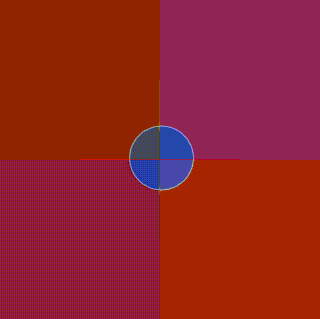
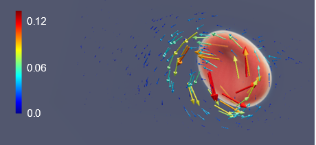
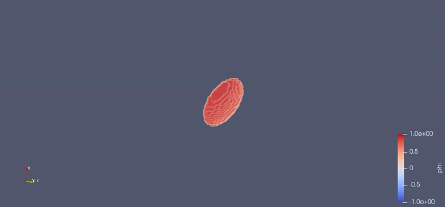
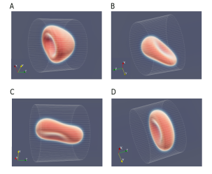

# RBC Shape Analysis

This repository contains a Python code which is used to study the deformation in 3D of a red blood cell under different flow conditions. An incompressible fluid is coupled to a 3D phase field model, which represents the cell.

This previous image corresponds to a 2D phase field representation. In blue the intracellular phase. In red the extracellular phase.

**Content**

- Jupyter Notebook file to show some plots in [Plots](Plots_Matplotlib).
- Python code (3d_RBC.py) where the equations are solved and the solution of the phase field (cell) is the final outcome.
- Python code (plot_save3d.py) to generate the paraview files to visualize the evolution of the cell 

**Brief Explanation**

In this study, the surface of the cell membrane will be mathematically described and analysed in 3D inside a Poiseuille flow. With this model, the variation of the capillary number, which characterizes the shear rate of the force relative to the membrane rigidity, will be studied in order to understand the different shapes of the simulated red blood cells.

$$
\nabla^2  \vec{\omega} = \frac{1}{\eta} (\nabla  \phi) \times (\nabla  \mu_m), \\
\partial_t  \phi = M( \nabla^2  \mu_m + \lambda_V) - (\nabla  \times  \vec{\psi})\ \cdot\ \nabla  \phi, \\
\nabla^2  \vec{\psi}= -\vec{\omega},
$$

The numerical integration consists in solving two Poisson equations and applying the results to compute a simple Euler method for temporal evolution. The bending free energy of the membrane is expressed in terms of the phase field and the Navier-Stokes equation is coupled with the cell membrane.

**Results**

Different outcomes for the analysis can be displayed in Paraview:

1. Vector Potential field, indicating high curvature regions:

2. Cell flowing through a cylinder with Poiseuille flow conditions:

3. Different cell shapes for different rigidities ordered from less rigid to more rigid:

